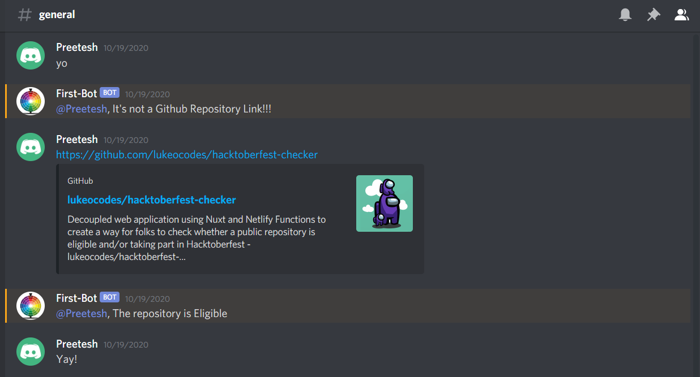
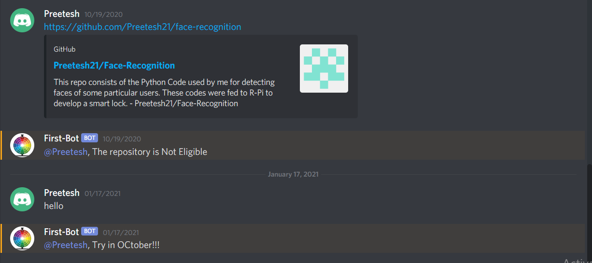

# Discord
To add the bot to your server use the [link](https://discord.com/oauth2/authorize?client_id=766002035208224849&scope=bot)

This bot was built by me to help the community to identify the latest repositories to be a part of the Hacktoberfest.

The repositories had to be tagged by the creators as hacktoberfest to be counted in hacktoberfest.

I had used ```Discord JS and Octokit``` to make this bot.

The tags and urls which would be required:
```
const keyTopic = 'hacktoberfest'
const keyPrLabel = 'hacktoberfest-accepted'
const validUrlPrefix = 'https://github.com/'
const moderationAccount = 'hacktoberfest-team'

```

Here are the screenshots of the bot in action classifying whether the link is of valid github repo, if the repo is eligible or not for the Hacktoberfest and whether it's actually October.



